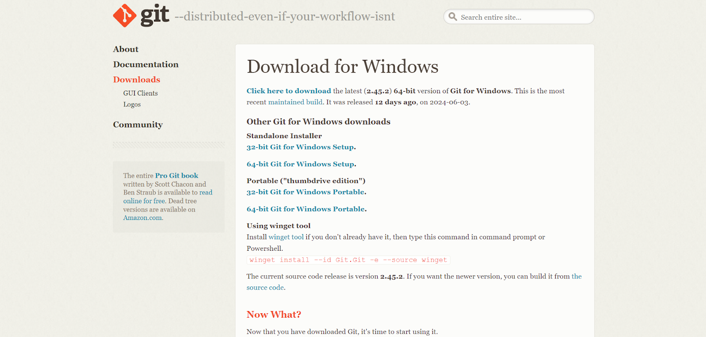

# Dev_Setup
Setup Development Environment

#Assignment: Setting Up Your Developer Environment

#Objective:
This assignment aims to familiarize you with the tools and configurations necessary to set up an efficient developer environment for software engineering projects. Completing this assignment will give you the skills required to set up a robust and productive workspace conducive to coding, debugging, version control, and collaboration.

#Tasks:

1. Select Your Operating System (OS):
   Choose an operating system that best suits your preferences and project requirements. Download and Install Windows 11. https://www.microsoft.com/software-download/windows11
Step 1: Create Windows 11 Installation Media

     Download the Media Creation Tool:

     Go to the Windows 11 download page: https://www.microsoft.com/software-download/windows11.
     
     Under the "Create Windows 11 Installation Media" section, click "Download now".
     (<Screenshot 2024-06-19 182052.png>)

      Open the downloaded Media Creation Tool executable file.

      (<Screenshot 2024-06-19 201655.png>)

      Accept the license terms.

      Set Up the Media Creation Tool:

      Choose the language, edition, and architecture (64-bit) and press next.

      (<Screenshot 2024-06-19 201851.png>)

      Select "USB flash drive" as the media to use. Alternatively, you can choose "ISO file" if you want to create a bootable DVD.

      (<Screenshot 2024-06-19 203412.png>)

      Create the Installation Media:
      
      (image-1.png)

      Insert a USB flash drive with at least 8 GB of storage.
      
      Select the USB drive from the list and click "Next". 

      (image-2.png)

      The tool will download Windows 11 and create the bootable USB drive.
      
      After that click finish

      (image-3.png)

      Step 2: Install Windows 11 Using the Installation Media

      Prepare Your PC:

      Back up all important data.
      
      Ensure your PC meets the Windows 11 system requirements.
      
      Boot from the USB Drive:
      
      (image-4.png)

      Start the Installation Process:

      Save the changes and exit the BIOS/UEFI settings. Your PC should now boot from the USB drive.
      
      The Windows Setup screen will appear. Select your language, time, and keyboard preferences, and click "Next".

      (image-5.png)

      Click "Install now".

      (image-6.png)

      Enter Product Key:

      If prompted, enter your Windows 11 product key. If you are upgrading from Windows 10, you may skip this step as the activation should be automatic.

      (image-7.png)

      Select Installation Type:

      Choose "Custom: Install Windows only (advanced)" for a clean installation.

      (image-8.png)

      choose windows type and click next.

      (image-9.png)

      Partition the Drive:

      Select the partition where you want to install Windows 11. You can delete existing partitions to create a new one, but this will erase all data on the selected partition.

      (image-10.png)

      Click "Next" to start the installation.
      
      Step 3: Complete the Installation

      Follow On-Screen Instructions:

      Windows 11 will now be installed on your PC. The process might take some time and your PC will restart several times.
      
      Set Up Windows 11:

      After installation, you will be guided through the initial setup process. Configure your preferences, sign in with your Microsoft account, and set up any additional settings.

      (image-11.png)

2. Install a Text Editor or Integrated Development Environment (IDE):
   Select and install a text editor or IDE suitable for your programming languages and workflow. Download and Install Visual Studio Code. https://code.visualstudio.com/Download

   Steps to Download and Install VS Code on Windows

Download VS Code:

Go to the Visual Studio Code download page: https://code.visualstudio.com/Download.
Under the "Download Visual Studio Code" section, click "Download for Windows".
This will start the download of the VS Code installer (VSCodeUserSetup-x64-1.X64-1.XX.X.exe).

(image-12.png)

Run the Installer:

Open the downloaded VS Code installer.
Run the VS Code installer (VSCodeUserSetup-x64-1.X64-1.XX.X.exe).
The installer wizard will appear.
Installation Prompt:

Accept the license agreement and click next.

(image-13.png)

Choose the location where you want the VS Code installation to be kept. Accept the default location and click next.

(image-14.png)

Accept the default Start Menu Folder and click Next.

(image-15.png)

Select additional tasks (optional but recommended):
Click on Create a Desktop icon.
Click on Add to path (important to use the command line).
Click register code as an Editor for supported files.
Adding “Open with Code” action to the Windows Explorer context menu.
Adding “Open with Code” to the directory context menu.
Click next.

(image-16.png)

The installation will begin. Click on the install button.
After clicking install, it should take about one minute to install VS Code on your device.

(image-17.png)

Finish Installation:

After installation, a setup window will appear. Tick on Launch VS Code and click Finish.

(image-18.png)

3. Set Up Version Control System:
   Install Git and configure it on your local machine. Create a GitHub account for hosting your repositories. Initialize a Git repository for your project and make your first commit. https://github.com

   sample Repo with git ignore: https://github.com/Johnnytash/this-is-a-test-repo.git.

Step 1: Download and Install Git

Download Git for Windows:

Go to the Git download page: https://git-scm.com/downloads and download the latest version for your operating system.

Run the Installer:

Open the downloaded Git installer.
Run the Git installer (Git-2.38.0-64-bit.exe).
The installer wizard will appear.
Accept the license agreement and click next.

(image-20.png)

choose the location where you want the Git installation to be kept. Accept the default location and click next.

(image-21.png)

Follow the Installation Wizard:

Choose the default options or customize the installation according to your preferences. Some key settings to note:

Adjusting your PATH environment.
Choosing the HTTPS transport backend.
Configuring the line-ending conversions.
Choosing the default Git editor.

(image-22.png)

Start folder:

You’ll be prompted to create a start folder. Leave it as is and click Next.

(image-23.png)

Text editor:

Choose a text editor to use with Git. Click on the drop-down menu to pick the text editor you like to use like Vim, Notepad++, etc, and click Next.

(image-24.png)

In the next steps choose all default options and click finish

(image-25.png)

Verify the Installation:

Open Command Prompt or Git Bash and run git –version

(image-26.png)

Step 2: Configuring Git

Open a terminal or command prompt (Git Bash).
Set your username and email: [git config --global user. name "Your Name"] [git config --global user.email "your.email@example.com"]
Step 3: Create a GitHub Account

Sign up for a GitHub account at GitHub. https://github.com
Enter your information:
Unique username
Email address
Password
Confirm password
Create GitHub account
Click on the link to verify your email address.
step 4: Initialize a Git repository

Create a new repository on GitHub:

Go to your GitHub profile page and click on your profile picture.
Go to your profile.
Click on your repositories.
Click on “Create new repository”.
Fill in the details:
Repository name
Repository description
Select “Public”
Select “Initialize this repository with a README”(optional)
Add .gitignore (optional)
Click on “Create repository”.
Choose a license (optional)
Click "Create repository"

(image-27.png)

step 5: Cloning Git Repository

Copy the repository URL from the GitHub page.
Open Git Bash or Command Prompt.
Run git clone repository URL
navigate to the cloned repository and run git status to check if the repository is cloned successfully.
verify the cloning with the ls command
Step 6: Commit and Push Changes

Create a new file: [touch example.txt]
Add content to the file: [nano example.txt]
Save and exit the editor (for nano, press Ctrl+X, then Y, and Enter).

(image-28.png)

Check the status of your repository: [git status]
Add the new file to the staging area: [git add example.txt]
Commit the changes: [git commit -m "Add example.txt"]
Push the changes to the remote repository: [git push -u origin master]

(image-30.png)

git ignore file

4. Install Necessary Programming Languages and Runtimes:
  Instal Python from http://wwww.python.org programming language required for your project and install their respective compilers, interpreters, or runtimes. Ensure you have the necessary tools to build and execute your code.

  INSTALLING PYTHON step1: Download python installer

Go to https://www.python.org/downloads/
Download the latest version of Python for Windows.
Select the installer that corresponds to the version of Python you want to install.

(image-31.png)

step2: Run the installer

Open the downloaded installer file.
Run the installer.
Check the box that says "Add Python to PATH".
Click "Install Now".

(image-32.png)

step3: Verify Installation

Open Command Prompt or Git Bash.
Run python --version
Verify the installation by checking the version number.

(image-33.png)

DOWNLOADING DART

step1: Visit the Dart SDK Download Page:

Go to https://www.dartlang.org/downloads
Download the latest version of Dart for Windows.
Select the installer that corresponds to the version of Dart you want to install.
step2: Install Dart SDK on Windows

Download the Dart SDK:
Click on the "Download Dart SDK" button for Windows.
Choose the .zip file for Windows and download it.

(image-34.png)
Extract the ZIP File:
Extract the downloaded ZIP file to a desired location on your computer, e.g., C:\dart-sdk.

(image-35.png)

Update Your PATH Environment Variable:
Open the Start Search, type in env, and select "Edit the system environment variables".
In the System Properties window, click on the "Environment Variables" button.
In the Environment Variables window, find the Path variable in the "System variables" section, select it, and click "Edit".
Click "New" and add the path to the bin directory inside the extracted Dart SDK folder (e.g., C:\dart-sdk\bin).
Click "OK" to close all the windows.

(image-36.png)

Step 3: Verify Dart Installation

Open Command Prompt or Git Bash.
Run dart --version
Verify the installation by checking the version number.

(image-37.png)

DOWNLOAD FLUTTER SDK

Step 1: System Requirements:

Windows 10 or later(64-bit).
Disk Space: 1.64 GB (not including disk space for IDE/tools).
Tools: Flutter depends on these tools being available in your environment.
Git for Windows
The choco command, if you use Chocolatey for package management
Step 2: Download Flutter SDK:

Go to https://flutter.dev/docs/get-started/install/windows
Download the latest version of Flutter for Windows.
Select the installer that corresponds to the version of Flutter you want to install.

(image-38.png)

Step 3: Install Flutter SDK on Your Operating System

Download the Flutter SDK:
Click on the "Download Flutter SDK" button for Windows

(image-39.png)

Choose the .zip file for Windows and download it.

(image-40.png)

Extract the ZIP File:

Extract the downloaded ZIP file to a desired location on your computer, e.g., C:\flutter-sdk.

(image-41.png)

Update Your PATH Environment Variable:

Open the Start Search, type in env, and select "Edit the system environment variables".
In the System Properties window, click on the "Environment Variables" button.
In the Environment Variables window, find the Path variable in the "System variables" section, select it, and click "Edit".
Click "New" and add the path to the bin directory inside the extracted Flutter SDK folder (e.g., C:\flutter-sdk\bin).
Click "OK" to close all the windows.

(image-42.png)

Verify Flutter Installation

Open Command Prompt or Git Bash.
Run flutter --version
Verify the installation by checking the version number.

(image-43.png)

Run Flutter Doctor:

Type flutter doctor and press Enter.
This command checks your environment and displays a report of the status of your Flutter installation. Ensure all required dependencies are installed.

(image-44.png)

5. Install Package Managers:
   If applicable, install package managers like pip (Python).

   Python (pip)

Ensure pip is installed and up-to-date: [python -m pip install --upgrade pip]
Install required packages: [python -m pip install -r requirements.txt]
To install a package using pip: [pip install package-name]

   (image-45.png)

6. Configure a Database (MySQL):
   Download and install MySQL database. https://dev.mysql.com/downloads/windows/installer/5.7.html
Download MySQL

Go to the MySQL Community Downloads page.https://dev.mysql.com/downloads/installer/
Download the latest version of MySQL for Windows.
Select the installer that corresponds to the version of MySQL you want to install.

(image-46.png)

Run the Installer:

Open the downloaded .msi file.
Choose Setup Type:

Choose a setup type (Developer Default, Server only, etc.) and click Next.

(image-47.png)

Check for Requirements:

The installer will check for and install the necessary dependencies.

(image-50.png)

Installation:

Click Execute to install the selected MySQL products.

(image-51.png)

Configuration:

Next, you need to configure the MySQL server, click "Next":

(image-52.png)

Standalone MySQL Server

Select the "Standalone MySQL Server / Classic MySQL Replication" item and click "Next":

(image-53.png)

Type and Networking

Next, in the "Config Type" parameter, select "Server Computer" and click "Next":

(image-54.png)

Password and authentication :

Select "Use Strong Password Encryption for Authentication" and click "Next":

(image-56.png)

Accounts and roles :
In the next window, you need to set a password for the root user (administrator). Also, here you can add other users (by clicking the "Add User" button), if necessary. After entering the password, click "Next":
At the next step, we leave all the default settings, and click "Next":

(image-58.png)

MySQL server settings:
Next, you need to apply the MySQL server settings by clicking "Execute":

(image-59.png)

Finish
Finally, click "Finish" to complete the installation.

7. Set Up Development Environments and Virtualization (Optional):
   Consider using virtualization tools like Docker or virtual machines to isolate project dependencies and ensure consistent environments across different machines.

    Using Docker Step 1: Install Docker

Download and install Docker Desktop from the Docker website.
Follow the installation instructions and start Docker Desktop. Step 2: Verify Docker Installation
Open Command Prompt or Git Bash.
Run docker --version
Verify the installation by checking the version number.
B. Using Virtual Machines Step 1: Install Virtualization Software

Download and install VirtualBox from the VirtualBox website.
VMware Workstation Player: Download and install from VMware. Step 2: Download an OS Image
Download an ISO file of the operating system you want to use (e.g., Ubuntu from https://ubuntu.com/download ). step 3: Create a Virtual Machine
Open VirtualBox or VMware Workstation Player.
Create a new VM:
In VirtualBox, click "New" and follow the prompts.
In VMware Workstation Player, click "New" and follow the prompts.
Configure VM settings:
Allocate memory (RAM) and CPU cores.
Create a virtual hard disk.
Install the OS:
Start the VM and select the downloaded ISO file.
Follow the installation instructions for the chosen operating system.

8. Explore Extensions and Plugins:
   Explore available extensions, plugins, and add-ons for your chosen text editor or IDE to enhance functionality, such as syntax highlighting, linting, code formatting, and version control integration.

   Python: Provides IntelliSense, linting, and debugging for Python files.
Pylance: Enhances Python language support.
ESLint: Detects and fixes linting issues in JavaScript and TypeScript files.
Stylelint: Detects and fixes style issues in CSS and SCSS files.
Prettier: Formats code automatically based on defined rules.
GitLens: Visualizes and provides Git integration.
Docker: Manages Docker containers, images, and Dockerfiles within VS Code.
SQLTools: Interacts with databases directly from VS Code.
C/C++: Enhances C/C++ language support.
HTML CSS Support: Enhances HTML/CSS development with class name completion and live previews.
IntelliSense for CSS class names in HTML: Adds autocomplete for CSS class names.
Code Runner: Runs code snippets or entire files directly from VS Code.
Live Server: Launches a local server with live reload for static and dynamic pages.
HTML Snippets: Provides quick access to common HTML code snippets.
CSS Peek: Navigate to CSS definitions from HTML files.
Live Server: Launches a local server with live reload for static and dynamic pages.

9. Document Your Setup:
    Create a comprehensive document outlining the steps you've taken to set up your developer environment. Include any configurations, customizations, or troubleshooting steps encountered during the process. 

#Deliverables:
- Document detailing the setup process with step-by-step instructions and screenshots where necessary.
- A GitHub repository containing a sample project initialized with Git and any necessary configuration files (e.g., .gitignore).
- A reflection on the challenges faced during setup and strategies employed to overcome them.

#Submission:
Submit your document and GitHub repository link through the designated platform or email to the instructor by the specified deadline.

#Evaluation Criteria:**
- Completeness and accuracy of setup documentation.
- Effectiveness of version control implementation.
- Appropriateness of tools selected for the project requirements.
- Clarity of reflection on challenges and solutions encountered.
- Adherence to submission guidelines and deadlines.

Note: Feel free to reach out for clarification or assistance with any aspect of the assignment.
